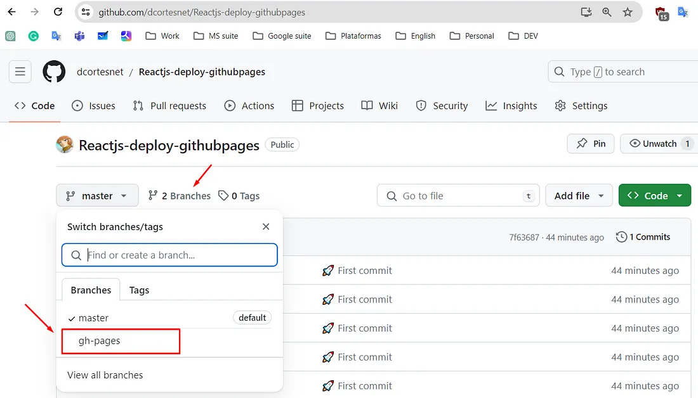
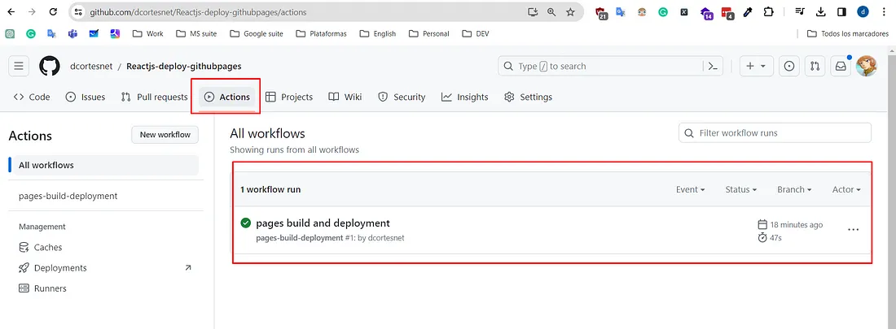

DOCUMENTACIÓN PROYECTO REACT: 

Integrantes: Eloy Gonzalés, Corina Heras

INTRODUCCIÓN: 
Este proyecto es una billetera virtual diseñada para ofrecer a sus usuarios un control sencillo y eficiente de sus ingresos y egresos a lo largo del tiempo. La aplicación permite regitrar, actualizar, y gestionar transacciones según las necesidades del usuario.

El sistema cuenta con una interfaz minimalista y fácil de usar, compuesta por dos pantallas principales: 

1. Home = Muestra un resumen de las transacciones realizadas si es que las hay, y su balance actual

2. Formulario de registro: Permite agregar, editar y actualizar los eventos financieros del usuario. 

La plataforma está pensada para brindar una experiencia intuitiva, asegurando que los usuarios puedan visualizar sus movimientos financieros de manera clara y organizada, ayudándolos a mejorar la administración de su dinero.


EJECUCÍON: 
1. Creación del Proyecto en ReactJS
para la ejecucíon de nuestro proyecto de manera local se siguieron los siguientes pasos, comenzando por la creacion de nuestro proyecto en ReactJS con el siguiente comando en la terminal:

```js
npm create vite@latest
# 1. Escriba el nombre del proyecto
# 2. Seleccione la opción React
# 3. Seleccione la opción TypeScript

# Ingresar al directorio del proyecto
cd nombre_proyecto

# Instalar dependencias
npm install

# Iniciar el servidor de desarrollo 
npm run dev

# Instalar dep para poder usar alias en tsconfig.json y vite.config.ts
npm i @types/node -D
```

2. Implementación de `tailwind` y prefijo `cd:

.Instalar TailwindCSS, PostCSS y Autoprefixer:


```js
npm install -D tailwindcss postcss autoprefixer

npx tailwindcss init -p
```

.A continuación, se creó el archivo `tailwind.config.js` en la raíz del proyecto.


```js
/** @type {import('tailwindcss').Config} */
export default {
  content: [
    './index.html','./src/**/*.{js,ts,jsx,tsx}'  
  ],
  //Usar prefijos en las clases puedes ser util para evitar
  prefix:'cd-',
  theme: {
    extend: {},
  },
  plugins: [],
};
```


2. Clonar el Repositorio

Se creó un repositorio público en GitHub y compartimos el enlace para que otros puedan acceder al código. Luego, se clonó el proyecto en nuestra máquina local con el siguiente comando: 

```js
git clone https://github.com/EloyG3186/Walletfy_Project.git
cd Walletfy_Project
```

DESPLIEGUE:

El despliegue de la aplicación se realizó con la ayuda de github Pages ,usando git Deploy, pero antes fue necesario realizar algunas modificaciones en el proyecto para garantizar su correcto funcionamiento en producción. A continuación, se detallan los pasos que fueron necesarios para el despliegue de el proyecto usando React con TypeScript. 

1. Preparación del Proyecto 
Antes de desplegarlo, se realizaron algunos ajustes en el código y configuración en nuestro:  
```js
vite.config.js
```

modificar la opción base. 

```js
import { defineConfig } from 'vite'
import react from '@vitejs/plugin-react'

// https://vitejs.dev/config/
export default defineConfig({
  plugins: [react()],
  base: 'https://Walletfy_Project.github.io/Reactjs-deploy-githubpages', // Link page
})
```

2. Instalar librería NPM 

El segundo paso es instalar la librería de NPM para poder trabajar y desplegar la aplicación en github pages usando el siguiente comando: 

```js
npm install --save-dev gh-pages
```

3. Script de NPM

Ahora, con nuestro paquete instalado, creamos un nuevo script de NPM para ayudarnos a realizar el empaquetado y el despliegue. Para esto, en nuestro package.json agregamos el script “deploy”: 


```js
....
 
"scripts": {
    ....

    "deploy": "npm run build && gh-pages -d dist"
  },

...
```

4. Despliegue

Por último ejecutamos nuestro script para poder desplegar, dentro de nuestra terminal: 

```js
> npm run deploy
```

VISUALIZANDO NUESTRA PÁGINA EN GITHUB: 

Al acceder a nuestro repositorio, notaremos la presencia de una nueva rama llamada “gh-pages”.




Se la seleccionará y a continuación al acceder a `Actions` se habrá creado y ejecutado un nuevo Workflow



Se habrá desplegado exitosamente, se puede acceder con la URL: 

```js
https://dcortesnet.github.io/Reactjs-deploy-githubpages/
```